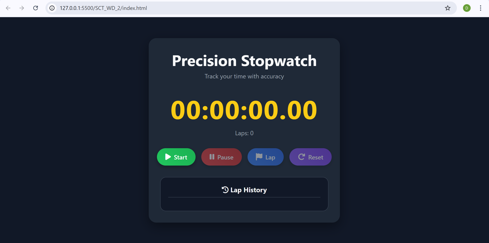

# Precision Stopwatch ⏱️
A modern and responsive stopwatch application built using HTML, CSS, and JavaScript, designed for accurate time tracking with advanced lap functionalities and a stylish user interface.

This project is part of SkillCraft Technology Internship – Task 2 in Web Development.

# 📌 Overview
The Precision Stopwatch offers both functional accuracy and elegant UI, making it perfect for everyday use, sports tracking, coding challenges, or any task requiring precise time measurement.

It features:

i)-High-precision timing in HH:MM:SS:CS format.

ii)-Ability to record laps while running or even when paused.

iii)-Current lap tracking for real-time lap monitoring.

iv)-A visually appealing, responsive design that works on all devices.

# Project Structure

       Stopwatch/
          └── SCT_WD_2/
             ├── index.html          # Main HTML structure
             ├── style.css           # Stylesheet for layout, theme, and animations
             ├── script.js           # Stopwatch logic and event handling
             ├── assets/             # Static resources
             │     └── preview/        # Screenshots, demo videos, or previews
             └── README.md           # Project documentation

# Features
i)-Start / Pause / Resume – Full control over the stopwatch.

ii)-Lap Recording – Record split times while running or paused.

iii)-Current Lap Display – Real-time tracking of the active lap duration.

iv)-Lap History – Organized list showing all recorded laps.

v)-00:00:00:00 Format – Displays hours, minutes, seconds, and centiseconds.

vi)-Responsive Design – Adapts to mobile, tablet, and desktop devices.

vii)-Elegant Buttons – Gradient styling, icons + labels, and smooth hover effects.

# Technologies Used
-> HTML5 – Semantic structure and layout.

-> CSS3 – Styling, gradients, responsiveness, and hover animations.

-> JavaScript (Vanilla) – Core stopwatch logic and DOM manipulation.

-> Font Awesome – For crisp, scalable icons.

# Preview

# Contribution Guidelines
We welcome contributions to enhance this project. To contribute:

i)-Fork the repository.

ii)-Create a new branch:
    git checkout -b feature/your-feature-name

iii)-Commit changes with descriptive messages:
     git commit -m "Add new feature: ..."

iv)-Push to your branch:
     git push origin feature/your-feature-name

v)-Open a Pull Request for review.

# License
This project is licensed under the MIT License – you are free to use, modify, and distribute it with proper attribution.

